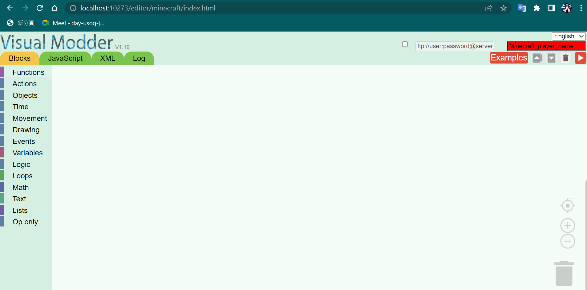
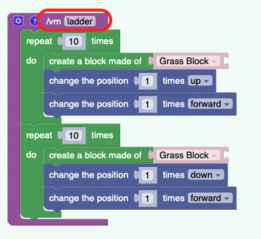

# minecraft_python

_當前minecraft windows版本為1.19.2, 此版本目前無法使用`code connection`,故改用java版_

## 環境

* minecraft java edition v1.19.2
* spigot-1.19.2
* python3
* mcpi-e v0.3.2006.2

## windows環境安裝流程

1. 安裝minecraft java edition
2. 安裝JDK 17
3. ~~click~~ `newworld.bat`~~會自動建一個~~`BuildTools`~~資料夾~~
4. ~~進入~~`BuildTools`~~後執行以下命令~~`java -jar BuildTools.jar --rev 1.19.2`
5. ~~將~~`StartMineCraftServer.bat`~~複製到~~`BuildTools`~~資料夾內後click即可啟動server~~(~~如下圖~~),~~但第一次啟動時會失敗,依照錯誤信息將`eula.txt`
   裡改為true後再次click即可~~

## 直接使用spigot-1.19.2.jar

1. 複製`spigot-1.19.2.jar`,`StartMineCraftServer.bat`到新資料夾中
2. click`StartMineCraftServer.bat`,第一次啟動時會失敗,依照錯誤信息將`eula.txt`裡改為true
3. 將`RaspberryJuice.jar`複製到`plugins`文件夾內
4. 再次click`StartMineCraftServer.bat`, 看到以下畫面代表成功
   

## minecraft連線server

1. 選擇多人連線
   

2. 加入server
   

## 程式積木模式

1. 複製`spigot-1.19.2.jar`,`StartMineCraftServer.bat`到新資料夾中
2. 建資料夾`plugins`, 將`visualmodder-1.19-20220930_1222_obf.jar`複製進去
3. click`StartMineCraftServer.bat`,第一次啟動時會失敗,依照錯誤信息將`eula.txt`裡改為true
4. 再次click`StartMineCraftServer.bat`, 看到以下畫面代表成功
   
5. 用上面介紹過的方式進入遊戲
6. 打開瀏覽器, 訪問`http://localhost:10273/editor/minecraft/index.html`, 可以見到以下畫面.
   
7. 將`Minecraft_player_name`改成你的名字
8. 開始設計程式積木, 完成後按紅色箭頭, 畫面會提示成功
9. 在遊戲中的談話視窗輸入`/vm 程式名稱`, 便會啟用  
   

## reference

[minecraft id list](https://minecraft-ids.grahamedgecombe.com/)