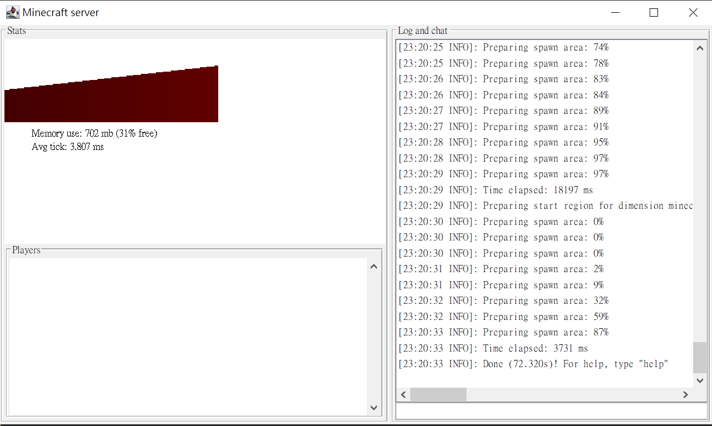
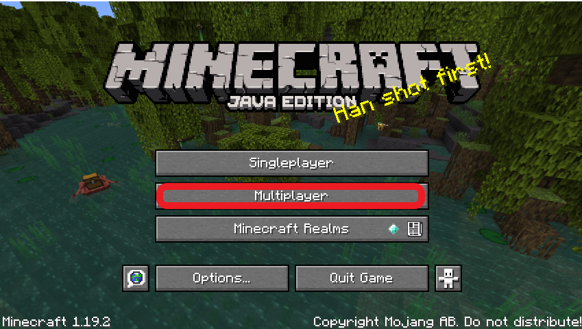
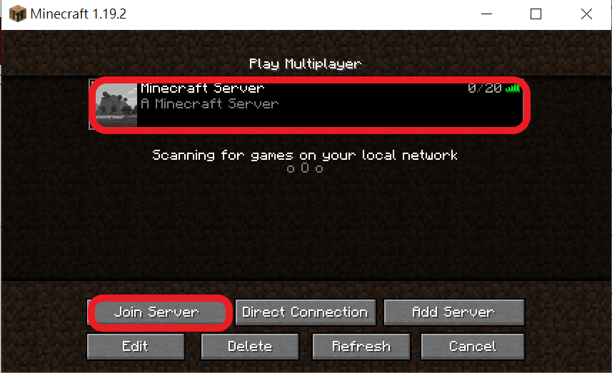

# minecraft_python

_當前minecraft windows版本為1.19.2, 此版本目前無法使用`code connection`,故改用java版_

## 環境
* minecraft java edition v1.19.2
* spigot-1.19.2
* python3
* mcpi-e v0.3.2006.2  

## windows環境安裝流程
1. 安裝minecraft java edition
2. 安裝JDK 17
3. click `newworld.bat`  
會自動建一個`BuildTools`資料夾
4. 進入`newworld.bat`後執行以下命令`java -jar BuildTools.jar --rev 1.19.2`
5. 將`RaspberryJuice.jar`複製到`BuildTools/plugins`文件夾內
6. 將`StartMineCraftServer.bat`複製到`BuildTools`資料夾內後click即可啟動server, 如下圖

## minecraft連線server
1. 選擇多人連線

2. 加入server

## reference
[minecraft id list](https://minecraft-ids.grahamedgecombe.com/)