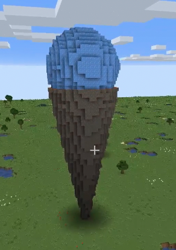

# 冰淇淋

* 分別完成餅乾杯與冰淇淋球的程式，最後合併執行
* 因為杯與球都是圓型，所以要用`create ellipse with radiusX`來畫圓
* 杯是一個從低到高的loop，材質用`Aracia Log`，試試看每次高度+1，半徑也+1效果如何，還可以怎麼調整
* 冰淇淋球可以視為一個圓球，你知道一個圓有幾度嗎？
* 嘗試在loop裏用`change the vertical degree`改變角度，看能不能做出球型